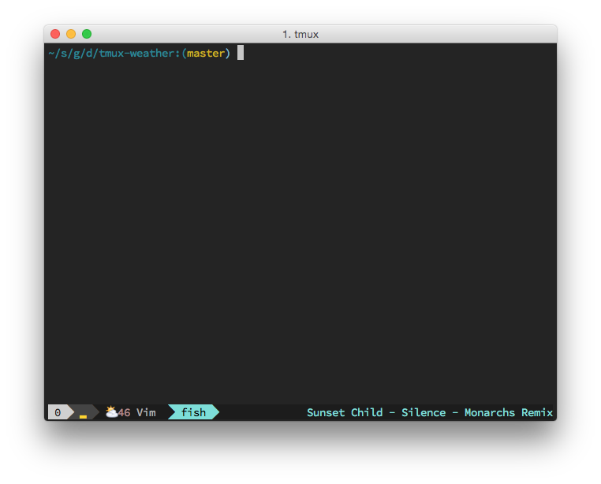

tmux-weather
============

Show weather in tmux status line. No powerline needed.



Installation
============
Install [latlon](https://github.com/jdxcode/latlon).

```
$ brew install jdxcode/brew/latlon
```

Copy `tmux-weather` into PATH.

```
cp ./tmux-weather /usr/local/bin/tmux-weather
```

Create a file at `~/.config/forecastio.json` with a forecast.io API key:

```json
{
  "token": "YOURAPIKEY"
}
```

Add this (or something like it) to `~/.tmux.conf`:

```
set -g status-right '#(~/bin/tmux-weather)'
```

Other Tmux Plugins
==================

* [tmux-cpu-info](https://github.com/dickeyxxx/tmux-cpu-info)
* [tmux-spotify-info](https://github.com/dickeyxxx/tmux-spotify-info)
